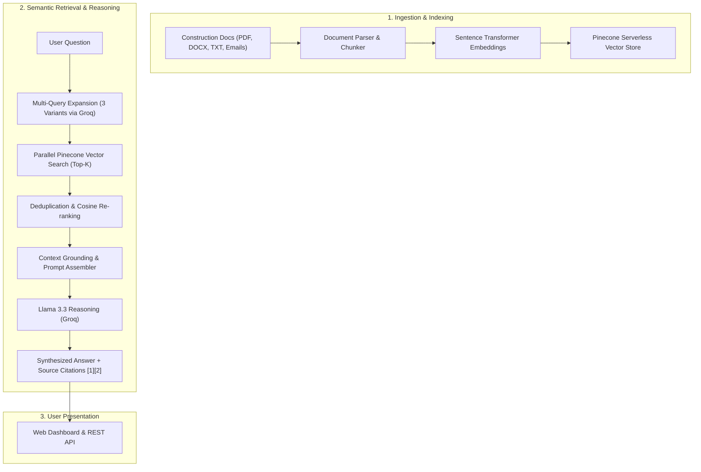

# BTP AI — Intelligent Construction Data & Regulatory RAG Assistant

[](https://www.python.org/)
[](https://flask.palletsprojects.com/)
[](https://www.pinecone.io/)
[](https://groq.com/)
[](LICENSE)

An enterprise Retrieval-Augmented Generation (RAG) platform tailored for civil engineering and construction firms (BTP — *Bâtiment et Travaux Publics*). Ingests complex architectural specifications (CCTP), technical standards (DTU, NF/EN/ISO), site inspection logs, and project correspondence, answering engineering queries with zero hallucinations and strict source citations.

---

## 📌 Overview & Industry Challenge

Construction managers and site supervisors deal with hundreds of disparate documents across every project lifecycle:
* **Technical Specifications (CCTP & DQE)** with strict material constraints.
* **French Building Standards (DTU & Eurocodes)** that dictate legal compliance.
* **Site Incident Reports & Multi-Party Emails** discussing delays, anomalies, and safety.

Manual cross-referencing is slow and error-prone. **BTP AI** solves this by uniting semantic search, multi-query expansion, and high-throughput LLM reasoning into an intuitive, real-time construction assistant.

---

## ✨ Key Features

* **Multi-Format Ingestion Pipeline**: Ingests `.pdf`, `.docx`, `.txt`, and structured `.json` site emails with automated metadata tagging (project name, lot, date, urgency level).
* **Multi-Query Retrieval Expansion**: Generates 3 semantic reformulations per engineering question to guarantee full recall across technical and vernacular terminology.
* **Zero-Hallucination Grounding**: The LLM is strictly constrained to retrieved context; if documents do not contain the answer, it explicitly reports insufficient context instead of guessing.
* **Precise Footnote Citations**: Every generated statement is paired with clickable/traceable source snippets (`[1]`, `[2]`), including page numbers and document lots.
* **Automated Regulatory Compliance Checker**: Analyzes site texts against French DTU and NF/EN standards, classifying criticality (`FAIBLE`, `MOYEN`, `ÉLEVÉ`, `CRITIQUE`) and outputting actionable risk audits.
* **Session Conversational Memory**: Sliding-window context queue preserving multi-turn engineering discussions.
* **Interactive Web Dashboard**: Single-page modern interface featuring document upload, semantic search console, confidence scores, and real-time system metrics.

---

## 🏗️ System Architecture



---

## 📁 Repository Structure

```
├── app.py              # Flask server, CORS routing & REST endpoints
├── config.py           # Environment parameters, vector dimensions & model configs
├── chunker.py          # Document segmentation & semantic sliding window
├── embeddings.py       # Embedding generation via sentence-transformers
├── vectorstore.py      # Pinecone vector index management, upsert & query logic
├── ingest.py           # Multi-format parsers (PDF, DOCX, TXT, JSON emails)
├── llm.py              # Prompt templates, multi-query expansion & compliance engine
├── dashboard.html      # Responsive web UI console
└── data/               # Sample construction dossiers & site email sets
```

---

## 🚀 Getting Started

### Prerequisites
* Python 3.11+
* Pinecone API Key ([pinecone.io](https://www.pinecone.io/))
* Groq Cloud API Key ([console.groq.com](https://console.groq.com/))

### 1. Clone & Setup Virtual Environment
```bash
git clone https://github.com/Yassir-Essabbahy/AI-System-for-Construction-Data-BTP-Project.git
cd AI-System-for-Construction-Data-BTP-Project

python -m venv venv
# Windows:
.\venv\Scripts\activate
# Linux/macOS:
source venv/bin/activate

pip install -r requirements.txt
```

### 2. Configure Environment Variables
Create a `.env` file in the root directory:
```env
PINECONE_API_KEY=your_pinecone_api_key
PINECONE_INDEX=btp-ai
PINECONE_CLOUD=aws
PINECONE_REGION=us-east-1

GROQ_API_KEY=your_groq_api_key
GROQ_MODEL=llama-3.3-70b-versatile

EMBEDDING_MODEL=all-MiniLM-L6-v2
EMBEDDING_DIM=384
TOP_K=4
MIN_SCORE=0.3
```

### 3. Ingest Documents
```bash
# Ingest all sample documents into Pinecone
python ingest.py
```

### 4. Run Application
```bash
python app.py
```
Open your browser at `http://127.0.0.1:5000` to access the interactive dashboard.

---

## 🔌 API Reference

### 1. Ask Question
* **Endpoint**: `POST /ask`
* **Request**:
  ```json
  {
    "question": "Quelles sont les exigences d'étanchéité pour la dalle du niveau R+2 ?"
  }
  ```
* **Response**:
  ```json
  {
    "answer": "Selon le CCTP Gros Œuvre, la dalle du R+2 requiert une membrane bicouche conforme au DTU 43.1 [1].",
    "sources": [
      {
        "rank": 1,
        "score": 0.89,
        "source": "CCTP_Lot03_GrosOeuvre.pdf",
        "page": 14,
        "lot": "03 - Gros Œuvre",
        "project": "Résidence Al-Amal"
      }
    ],
    "chunks_retrieved": 4,
    "queries_used": 4
  }
  ```

### 2. Regulatory Compliance Audit
* **Endpoint**: `POST /compliance`
* **Request**:
  ```json
  {
    "text": "Coulage du béton réalisé par temps de gel à -4°C sans adjuvant retardateur ni protection thermique.",
    "project": "Chantier Tour A"
  }
  ```
* **Response**:
  ```json
  {
    "project": "Chantier Tour A",
    "analysis": {
      "criticite": "CRITIQUE",
      "risques_reglementaires": ["Non-respect du DTU 21 (Bétonnage par temps froid)"],
      "risques_chantier": ["Chute drastique de la résistance à la compression", "Fissuration précoce"],
      "actions_recommandees": ["Arrêt immédiat du coulage", "Carottage et tests au scléromètre après cure"],
      "resume": "Non-conformité majeure sur les conditions thermiques de mise en œuvre du béton."
    }
  }
  ```

---

## 👨‍💻 Author

**Yassir ESSABAHY**  
* Solo Game Developer & Technical Artist  
* Portfolio: [yessirdev.vercel.app](https://yessirdev.vercel.app)  
* LinkedIn: [linkedin.com/in/yessir001](https://www.linkedin.com/in/yessir001/)  
* Instagram: [@thats_yessir](https://www.instagram.com/thats_yessir)  
* Email: [moroccoyassir@gmail.com](mailto:moroccoyassir@gmail.com)
